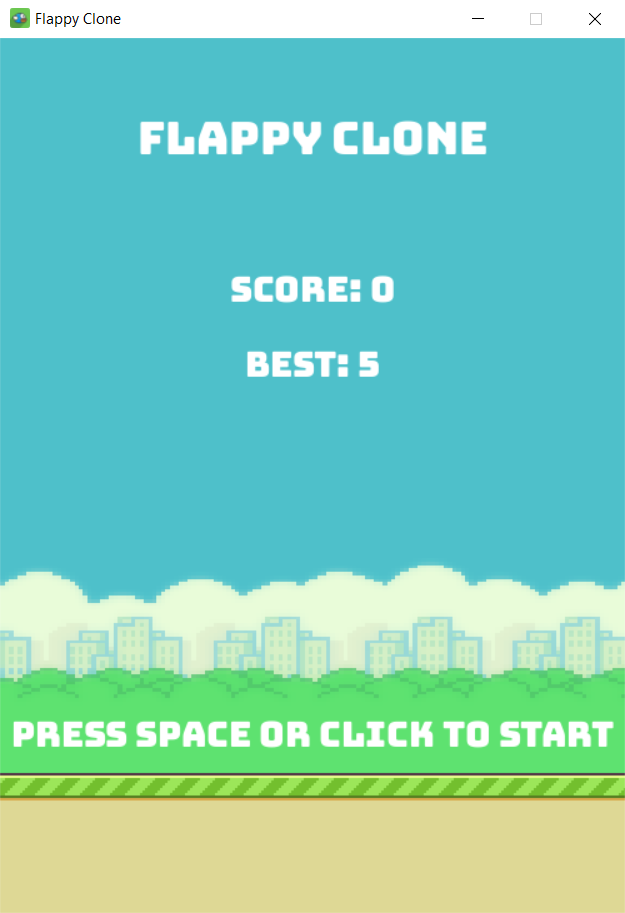

# 📌 Flappy Clone

  
_Клон классической игры Flappy Bird с дополнительными функциями._

---

## 🔍 Описание

**Flappy Clone** — это аркадная игра, вдохновленная классическим Flappy Bird, созданная для изучения разработки игр с использованием библиотеки Pygame.  
Ключевые особенности:  
- 🚀 Динамический игровой процесс  
- 🔒 Сохранение лучших результатов  
- 🎨 Оригинальные спрайты и плавные анимации

> **Примечание**: Некоторые звуки и изображения взяты у автора ассетов [samuelcust](https://github.com/samuelcust/flappy-bird-assets.git) и используются с его разрешения.

---

## 🛠️ Установка и запуск

### Требования
- Python версии 3.10 или выше
- Установленные зависимости (Pygame)

### Инструкция по установке
1. Склонируйте репозиторий:
    ```bash
    git clone https://github.com/username/flappy-clone.git
    ```
2. Установите зависимости:
    ```bash
    pip install pygame
    ```
3. Запустите проект:
    ```bash
    python main.py
    ```

---

## ⚙️ Основной функционал

- **Игровой процесс**: Управляйте птицей, избегая столкновений с препятствиями и землей.  
- **Меню**: Удобный интерфейс для отображения текущего и лучшего счета.  
- **Сохранение данных**: Автоматическое сохранение рекордов в файл JSON.  

---

## 🎨 Скриншоты

| Главный экран                 | Игровой процесс                        |
|-------------------------------|----------------------------------------|
|  |   |


---

## 📚 Используемые технологии

- **Язык**: Python  
- **Библиотека для игры**: Pygame  
- **Формат сохранения данных**: JSON  

---

## 🛡️ Лицензия

Этот проект распространяется под лицензией MIT. Подробнее см. [LICENSE](LICENSE).

---

## 📧 Контакты для связи

- Автор: Akilary
- Email: a.akilary@gmail.com
- GitHub: https://github.com/akilary

---

_Star this repo 🌟, если проект вам понравился!_
